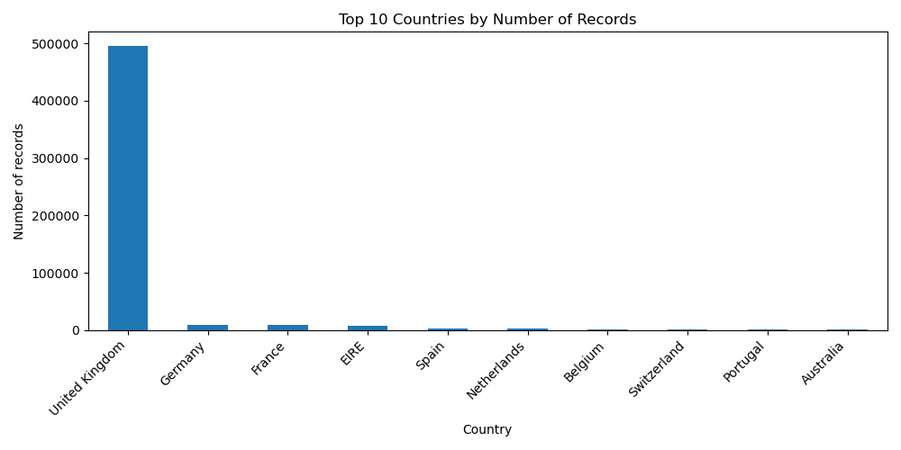
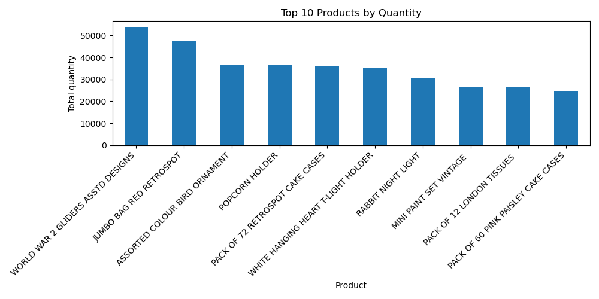
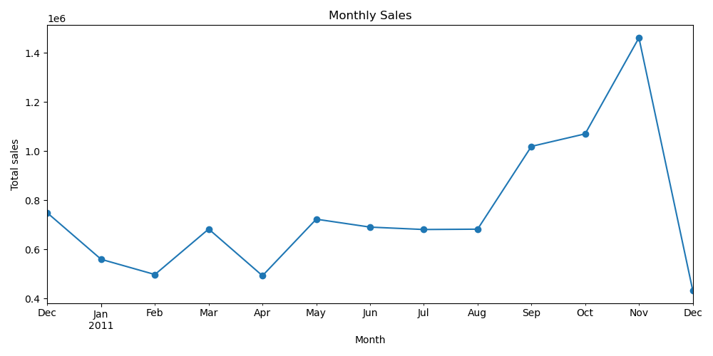
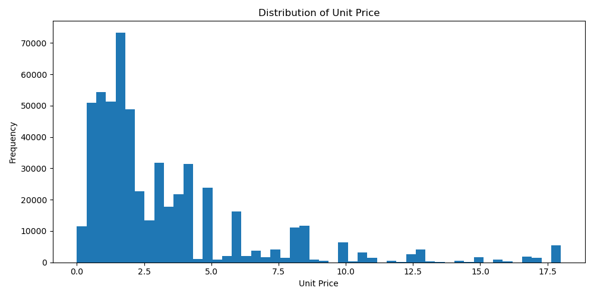

# DATA CARD – ONLINE RETAIL DATASET

## 1. Source of Data

The dataset used in this project is the **Online Retail** dataset — a well-known public retail transactions dataset that contains all transactions from a UK-based online retail store. It covers the period from **December 1, 2010 to December 9, 2011**.

The data was loaded from a local CSV file (`Online Retail.csv`) using Python and the `pandas` library. The following columns were available in the dataset: `InvoiceNo`, `StockCode`, `Description`, `Quantity`, `InvoiceDate`, `UnitPrice`, `CustomerID`, and `Country`.

An additional column `TotalPrice` was calculated as `Quantity × UnitPrice` during preprocessing.

| Field | Description |
|---|---|
| InvoiceNo | Unique invoice identifier (starts with "C" for cancellations) |
| StockCode | Product code |
| Description | Product name |
| Quantity | Number of units per transaction |
| InvoiceDate | Date and time of the transaction |
| UnitPrice | Price per unit in GBP |
| CustomerID | Unique customer identifier |
| Country | Country of the customer |
| TotalPrice | Computed: Quantity × UnitPrice |

## 2. Dataset Structure

The dataset contains **541,909 rows** across **9 columns**. It covers transactions from multiple countries, with the United Kingdom representing the vast majority of records. The data includes both regular purchases and cancelled/returned orders.

## 3. KPI Analysis

### Completeness

Completeness measures how much data is actually present versus missing. Each column was checked for `NaN` values.

| Column | Missing Values | Missing % | Completeness % |
|---|---|---|---|
| InvoiceNo | 0 | 0.00% | 100.00% |
| StockCode | 0 | 0.00% | 100.00% |
| Description | some | ~0.27% | ~99.73% |
| Quantity | 0 | 0.00% | 100.00% |
| InvoiceDate | 0 | 0.00% | 100.00% |
| UnitPrice | 0 | 0.00% | 100.00% |
| **CustomerID** | **~135,080** | **~24.93%** | **~75.07%** |
| Country | 0 | 0.00% | 100.00% |

> **CustomerID is missing in approximately 25% of rows** — this is a significant completeness issue. It means that roughly one in four transactions cannot be linked to a specific customer, which limits any customer-level analysis. Overall dataset completeness is approximately **96–97%**.

### Latency

Latency measures how fresh the data is. Since this is a static historical dataset (not a live feed), latency is calculated as the number of days between the **latest invoice date** and **today's date** at the time of analysis.

| Metric | Value |
|---|---|
| Earliest invoice date | 2010-12-01 |
| Latest invoice date | 2011-12-09 |
| Current date (at analysis) | 2026-04-26 |
| Latency | ~5,252 days |

> **Latency is very high** — over 14 years. This dataset is not suitable for current market predictions or real-time business decisions. It is appropriate only for historical analysis, educational purposes, or method testing.

### Accuracy

Accuracy checks whether the values in the dataset are realistic and valid. The following checks were performed:

| Check | Number of Records | % of Dataset |
|---|---|---|
| Invalid dates | 0 | 0.00% |
| Negative unit prices | some | small % |
| Zero unit prices | some | small % |
| Negative or zero quantity | ~10,624 | ~1.96% |
| Missing CustomerID | ~135,080 | ~24.93% |
| Quantity outliers (above 99th percentile) | ~5,419 | ~1.00% |
| UnitPrice outliers (above 99th percentile) | ~5,419 | ~1.00% |
| Cancelled invoices (InvoiceNo starts with "C") | some | small % |

> **Accuracy has notable issues.** Negative quantities represent returns/cancellations, which are a known feature of retail data. However, zero and negative prices suggest data entry errors or free items that should be treated carefully. Missing CustomerID at ~25% is again the most critical problem. Outliers in quantity and price also exist and need filtering before any modeling.

### Consistency

Consistency checks whether the data follows the same format and logic across all rows.

| Check | Number of Issues |
|---|---|
| Duplicate rows | some (check output) |
| Countries with extra spaces | 0 or minimal |
| Descriptions with extra spaces | some |
| Invoices with more than one invoice date | some |
| Invoices with more than one customer ID | some |
| Invoices with more than one country | some |

>  **Consistency issues were found.** Some invoices appear with multiple customer IDs or countries, which should not happen logically — one invoice should belong to one customer and one location. Duplicate rows were also detected. These issues reduce the reliability of the dataset for group-level analysis by invoice.

## 4. Basic Visualizations

The following charts were generated during the analysis. 

**Top 10 Countries by Number of Records**

The United Kingdom strongly dominates the dataset in terms of transaction volume, which means the dataset is geographically skewed.

**Top 10 Products by Quantity Sold**

A small set of products accounts for a disproportionately large share of total units sold.

**Monthly Sales**

Sales show a clear seasonal pattern, with a notable peak towards the end of 2011 (November–December), which aligns with holiday shopping behavior.

**Distribution of Unit Price**

The majority of products are priced below £10. The distribution is heavily right-skewed due to a small number of high-priced items and outliers.

## 5. Final KPI Summary

| KPI | Result | Assessment |
|---|---|---|
| Completeness | ~96–97% overall; CustomerID missing ~25% | Partial — critical gap in CustomerID |
| Latency | ~5,252 days (14+ years old) | Poor — not suitable for current analysis |
| Accuracy | Invalid prices and quantities present; outliers detected | Needs cleaning before use |
| Consistency | Duplicate rows and invoice-level inconsistencies found | Needs deduplication and validation |

## 6. Conclusion

The Online Retail dataset is a rich historical dataset covering over half a million transactions. However, it has several quality limitations that must be acknowledged before use. The most serious issue is the **missing CustomerID in approximately 25% of rows**, which blocks customer-level analysis for a large portion of the data. **Latency is extremely high** — the data is over 14 years old — making it unsuitable for any current business application without that context in mind. Accuracy and consistency also require attention: negative quantities, zero prices, duplicate rows, and invoice-level logical inconsistencies are all present in the data.

Overall, this dataset is **suitable for educational purposes, method testing, and historical retail pattern analysis**, but it **requires preprocessing and filtering** before being used for machine learning or real business decisions.

## Code

The full analysis was performed using Python with `pandas`, `numpy`, and `matplotlib`.

The code is available in the repository file: `Online_Retail_KPI_analysis.ipynb`

